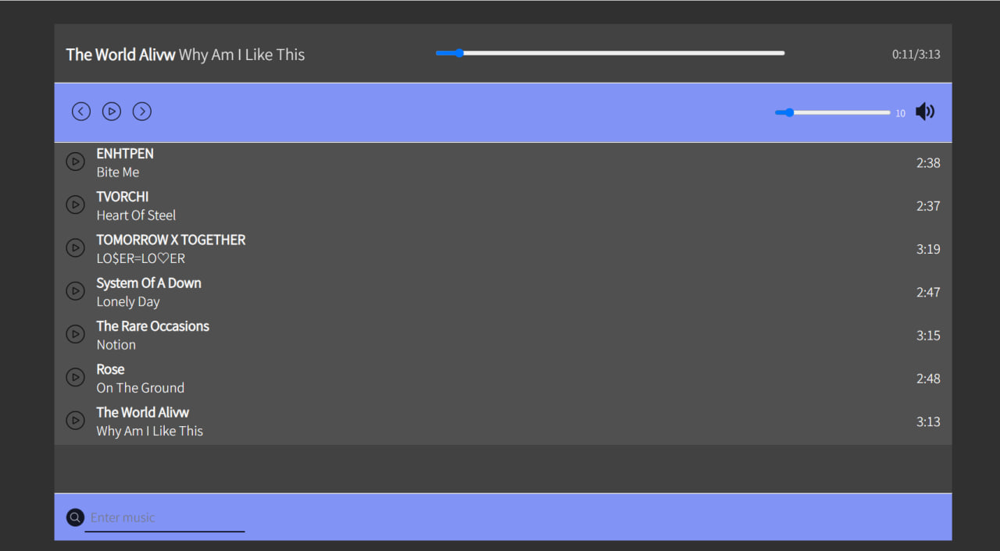

# Music-player

Цей проект є музичним плеєром, розробленим на VueJS.
Користувачі можуть вибирати зі списку доступних тонів для відтворення. Плеєр підтримує додавання та керування списком треків. Будований регулятор гучності дозволяє користувачам налаштовувати рівень звуку на власний розсуд.
Під час відтворення треку плеєр показує поточний час запису, дозволяючи користувачам легко орієнтуватися в тривалості мелодії, що прослуховується.


## Project setup
```
npm install
```

### Compiles and hot-reloads for development
```
npm run serve
```

### Compiles and minifies for production
```
npm run build
```

### Customize configuration
See [Configuration Reference](https://cli.vuejs.org/config/).
